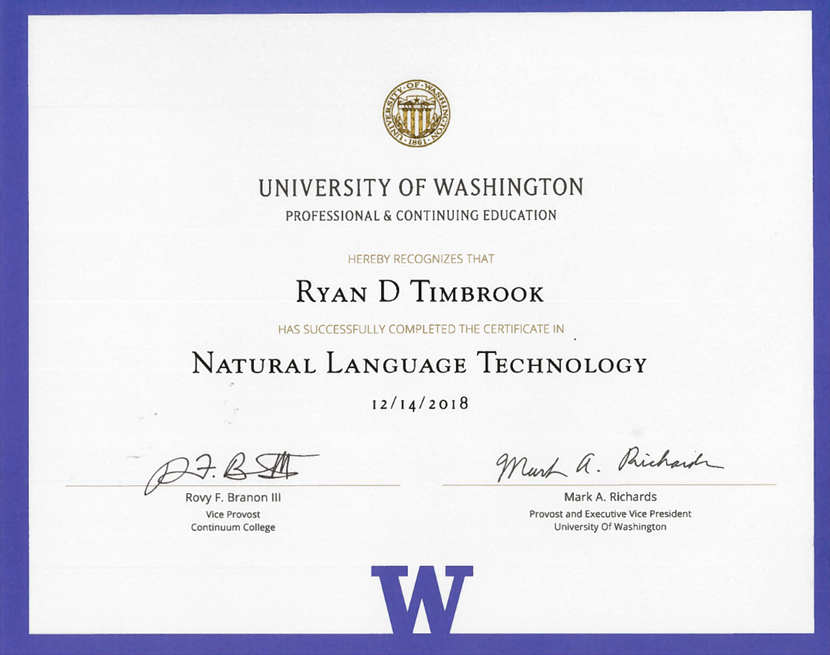

## Ryan Timbrook (Graduate Student - Course Work Repository)
**[LinkedIn Profile](https://www.linkedin.com/in/ryantimbrook/)**

## [University of Washington, Master of Science in Computational Linguistics](https://www.compling.uw.edu/?utm_source=pce.uw.edu&utm_medium=referral&utm_campaign=(not%20set))
### [Certificate in Natural Language Technology](https://www.pce.uw.edu/certificates/natural-language-technology)

#### [LING 570 - Shallow Processing Techniques for NLP](https://www.pce.uw.edu/courses/shallow-processing-techniques-for-natural-language-processing) - Summer 2016
#### SYLLABUS

                                  **University of Washington, Professional & Continuing Education**
                                         **LING 570 - Shallow Processing Techniques for NLP**     

**ABOUT THIS COURSE:**  
Computational linguistics builds on the theory and practice of multiple fields (linguistics, computer science and statistics) to design computer applications that involve the automatic processing of natural language speech or text by machines. This course teaches techniques and algorithms for associating relatively surface-level structures and information with natural language corpora.

**Topics include:**  
* Word segmentation/tokenization
* Morphological analysis
* Part-of-Speech
* Language Modeling
* Named entity recognition
* Chunk parsing
* Word-sense disambiguation
* Linguistic resources that can be leveraged for these tasks (e.g., treebanks)

These techniques allow you to locate items of interest (e.g., product names, diagnoses, proper names) in running text, correlate their occurrences with each other and normalize text for further processing.

#### [LING 570 - Shallow Processing Techniques for NLP](https://www.pce.uw.edu/courses/shallow-processing-techniques-for-natural-language-processing)

